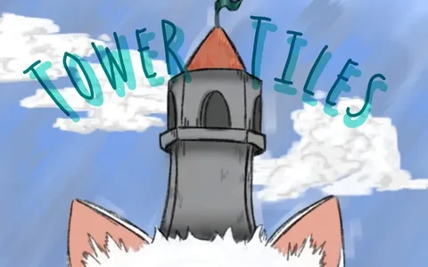
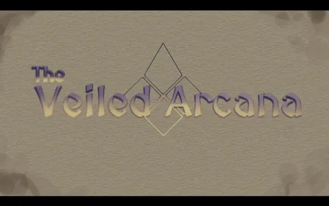
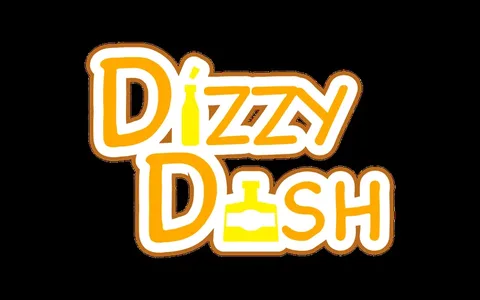
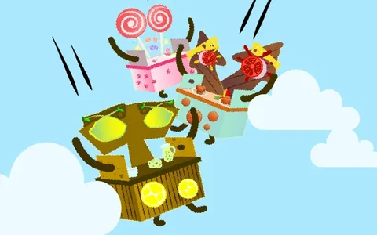
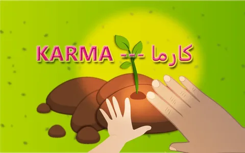
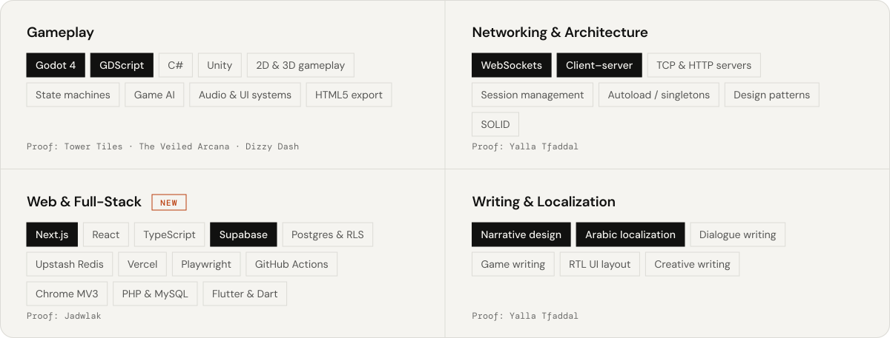

<a href="https://ahmadnasserx.com">
  <picture>
    <source media="(prefers-color-scheme: dark)" srcset="assets/header-dark.svg">
    
  </picture>
</a>

<p align="center">
  <a href="https://ahmadnasserx.com"></a>
  <a href="https://www.linkedin.com/in/ahmad-nasser-x/"></a>
  <a href="https://ahmadnasser.itch.io/"></a>
  <a href="mailto:ahmadnasser05@outlook.com"></a>
  <a href="https://ahmadnasserx.com/Ahmad-Nasser-Gameplay-Programmer.pdf"></a>
</p>

I build real-time game systems in **Godot 4** and ship full-stack products with **Next.js**. The two I'm proudest of right now: **[Jadwlak](https://jadwlak.org)**, a course planner live for students across all four Beirut Arab University campuses, and a party game where eight phones join a TV over my own WebSocket server.

```gdscript
class_name AhmadNasser extends Developer

var based_in := "Tripoli, Lebanon"
var studying := ["BSc Computer Science @ BAU", "BA English @ Lebanese University"]
var graduating := 2027
var speaks := ["Arabic", "English"]

var ships := {
	"games": ["Godot 4", "GDScript", "C#"],
	"web": ["Next.js", "React", "TypeScript", "Supabase", "Cloudflare"],
	"words": ["narrative design", "dialogue", "Arabic localization"],
}

func _ready() -> void:
	open_to(["internships", "part-time roles", "game jams"])
```

## Featured work

<a href="https://jadwlak.org">
  <picture>
    <source media="(prefers-color-scheme: dark)" srcset="assets/case-jadwlak-dark.svg">
    
  </picture>
</a>

**[Jadwlak](https://jadwlak.org)** (جدولك, "your schedule") is a free timetable planner for Beirut Arab University. BAU's official system lets students register for courses but not see their week before committing. Jadwlak lets them build that week first: search the catalog, compare three plans, catch every clash, then register.

> **The hard part.** Registration day sends the whole student body to the planner in the same few hours, and it all has to fit in free tiers. The catalog API is cached at Cloudflare's edge for five minutes, so the entire campus costs one Supabase query per five minutes, and returning visitors get a `304` instead of the full catalog. Students never make an account: plans live in `localStorage` and no personal data is collected. Running cost: the domain, about $14 a year.

Also inside: a headless Playwright scraper on GitHub Actions, scheduled around BAU's registration calendar; Upstash sliding-window rate limits on every API route; a per-request nonce CSP; 74 Playwright end-to-end tests, 29 of them security checks; a Manifest V3 Chrome extension that imports offerings from BAU's portal; and a move from Vercel to Cloudflare Workers through OpenNext.

`Next.js 15` `React 19` `Cloudflare Workers` `OpenNext` `Supabase` `Postgres + RLS` `Upstash Redis` `Playwright` `GitHub Actions` `Chrome MV3` · [jadwlak.org ↗](https://jadwlak.org)

<br>

<a href="https://ahmadnasserx.com/#p-yalla-tfaddal">
  <picture>
    <source media="(prefers-color-scheme: dark)" srcset="assets/case-yalla-dark.svg">
    
  </picture>
</a>

**Yalla Tfaddal** is a Jackbox-style party game, fully in Arabic. Up to eight players scan a QR code on the TV and play from their phone's browser, with nothing to install.

> **The hard part.** Godot's built-in `WebSocketMultiplayerPeer` dropped every existing client whenever a new one connected. I replaced it with my own networking layer on a raw `TCPServer`, one `WebSocketPeer` per client, then added session tokens so a phone that locks mid-game rejoins its own player slot instead of arriving as a new player.

Also inside: six autoload singletons, nine minigames on one scene-flow and scoring framework, a QR encoder in pure GDScript, and automatic Cloudflare tunnel setup with a LAN fallback for offline play. Playtests exposed disconnect and rejoin failures; a scoped stability pass fixed them.

`Godot 4.7` `GDScript` `WebSockets` `TCP / HTTP` `Cloudflare Tunnel` · Source available on request

## More games

<table>
  <tr>
    <td width="33%" valign="top">
      <a href="https://ahmadnasser.itch.io/tower-tiles"></a>
      <br><b>Tower Tiles</b>
      <br><sub>3D TOWER DEFENSE · SOLO · 2025</sub>
      <br>Grid placement with tile validation, an upgrade economy, and a spawn curve instead of waves. Web build included.
      <br><a href="https://ahmadnasser.itch.io/tower-tiles">Play</a> · <a href="https://github.com/AhmadNasserx/tower-tiles">Source</a>
    </td>
    <td width="33%" valign="top">
      <a href="https://realkotob.itch.io/the-veiled-arcana"></a>
      <br><b>The Veiled Arcana</b>
      <br><sub>GLOBAL GAME JAM 2026 · TEAM OF 5</sub>
      <br>Memory tiles whose matching rules change with each mask. I built the card system, the mask switch and the AudioManager.
      <br><a href="https://realkotob.itch.io/the-veiled-arcana">Play</a>
    </td>
    <td width="33%" valign="top">
      <a href="https://realkotob.itch.io/dizzy-dash"></a>
      <br><b>Dizzy Dash</b>
      <br><sub>GLOBAL GAME JAM 2024 · BEIRUT · TEAM OF 6</sub>
      <br>Every martini you grab warps your controls a little more. 48 hours, one of two programmers.
      <br><a href="https://realkotob.itch.io/dizzy-dash">Play</a> · <a href="https://github.com/realkotob/ggj-2024">Source</a>
    </td>
  </tr>
  <tr>
    <td width="33%" valign="top">
      <a href="https://etherxgames.itch.io/last-stand-standing"></a>
      <br><b>Last Stand Standing</b>
      <br><sub>2D BULLET HELL · ETHERX GAMES · 2024</sub>
      <br>A lemonade stand, a burger stand and a candy stand go to war. Three asymmetric combat styles.
      <br><a href="https://etherxgames.itch.io/last-stand-standing">Play</a>
    </td>
    <td width="33%" valign="top">
      <a href="https://etherxgames.itch.io/karma"></a>
      <br><b>Karma</b>
      <br><sub>2D ACTION · ETHERX GAMES · 2024</sub>
      <br>Wipe out the bugs, protect your plant. Built around precise movement.
      <br><a href="https://etherxgames.itch.io/karma">Play</a>
    </td>
    <td width="33%" valign="top">
      <b>Course projects</b>
      <br><sub>GODOT 4 · WHERE I STARTED</sub>
      <br><br><a href="https://github.com/AhmadNasserx/Martian-Mike">Martian Mike</a>
      <br><a href="https://github.com/AhmadNasserx/Project-Boost">Project Boost</a>
      <br><a href="https://github.com/AhmadNasserx/Alien-Attack">Alien Attack</a>
      <br><br><a href="https://ahmadnasser.itch.io/">Everything on itch.io ↗</a>
    </td>
  </tr>
</table>

## Toolbox

<picture>
  <source media="(prefers-color-scheme: dark)" srcset="assets/toolbox-dark.svg">
  
</picture>

## Patch notes

| When | | What changed |
| :-- | :-- | :-- |
| `2026-09` | **LIVE** | [Jadwlak](https://jadwlak.org) goes live for BAU's Fall 2026/27 planning, then moves from Vercel to Cloudflare Workers |
| `2026` | LEARNING | TechTalks Full-Stack Bootcamp: Next.js, TypeScript and PR-based code review |
| `2026-06` | BUILDING | Yalla Tfaddal: custom WebSocket server, nine minigames, stability pass from playtests |
| `2026-01` | JAM | Global Game Jam 2026, The Veiled Arcana, team of 5 |
| `2025-03` | **SHIPPED** | Tower Tiles, a 3D tower defense built solo |

<details>
<summary>Older patches</summary>

| When | | What changed |
| :-- | :-- | :-- |
| `2024` | STARTED | BSc Computer Science at BAU and BA English at the Lebanese University, concurrently |
| `2024-06` | **SHIPPED** | Last Stand Standing and Karma with EtherX Games |
| `2024-01` | JAM | Global Game Jam 2024, Beirut: Dizzy Dash in 48 hours on a team of 6 |
| `2023-11` | NEW GAME | First Godot course: Ultimate Game AI for Godot Beginners |

</details>

## Say hi

Email is the fastest way to reach me: **[ahmadnasser05@outlook.com](mailto:ahmadnasser05@outlook.com)**. I reply within a day or two. The full story, with 17 certificates and a downloadable CV, lives at **[ahmadnasserx.com](https://ahmadnasserx.com)**.

<a href="https://ahmadnasserx.com">
  <picture>
    <source media="(prefers-color-scheme: dark)" srcset="assets/footer-dark.svg">
     continue? [Y/n] — ahmadnasserx.com" src="assets/footer-light.svg" width="100%">
  </picture>
</a>
